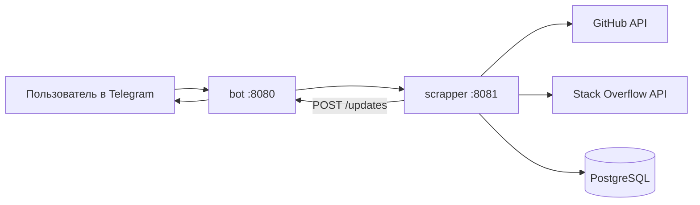

# LinkTracker

**LinkTracker** — это Telegram-бот для отслеживания обновлений по ссылкам. Пользователь отправляет ссылку на GitHub-репозиторий или вопрос на Stack Overflow, а приложение периодически проверяет изменения и присылает уведомление в Telegram.

## Возможности

- регистрация пользователя через Telegram-бота;
- добавление и удаление ссылок из отслеживания;
- фильтрация списка ссылок по тегам;
- проверка обновлений по ссылкам по расписанию;
- поддержка двух источников:
  - **GitHub**
  - **Stack Overflow**
- отправка уведомлений в Telegram при обнаружении изменений.

## Архитектура

Проект состоит из двух микросервисов:

- **bot** — Telegram-бот, который принимает команды пользователя;
- **scrapper** — сервис, который хранит ссылки, ходит во внешние API и проверяет обновления.



## Технологии

- **Java 25**
- **Spring Boot 4**
- **Spring Web MVC**
- **Spring RestClient**
- **Spring Data JPA / JDBC**
- **Liquibase**
- **PostgreSQL**
- **Docker / Docker Compose**
- **OpenAPI / Swagger UI**
- **JUnit 5, Testcontainers, WireMock**

## Поддерживаемые команды бота

- `/start` — регистрация пользователя
- `/help` — список команд
- `/track` — добавить ссылку в отслеживание
- `/list` — показать все отслеживаемые ссылки
- `/list <tag>` — показать ссылки по тегу
- `/untrack` — удалить ссылку из отслеживания
- `/cancel` — отменить текущий диалог

## Что нужно для запуска

Перед стартом убедитесь, что у вас установлены:

- **JDK 25**
- **Docker** и **Docker Compose**
- **Maven Wrapper** уже лежит в репозитории (`./mvnw`)
- Telegram bot token
- GitHub token
- Stack Overflow API key и access token

> В текущей реализации `scrapper` валидирует настройки GitHub и Stack Overflow на старте, поэтому переменные для обоих API должны быть заполнены.

## Переменные окружения

### Для `bot`

| Переменная | Описание |
|---|---|
| `TELEGRAM_TOKEN` | токен Telegram-бота |

### Для `scrapper`

| Переменная | Описание |
|---|---|
| `DB_URL` | JDBC URL базы данных |
| `DB_USER` | пользователь PostgreSQL |
| `DB_PASSWORD` | пароль PostgreSQL |
| `GITHUB_TOKEN` | токен GitHub API |
| `STACKOVERFLOW_KEY` | ключ приложения Stack Overflow |
| `STACKOVERFLOW_ACCESS_KEY` | access token Stack Overflow |
| `ACCESS_TYPE` | тип доступа к данным: `SQL`, `ORM`, `IN_MEMORY` |

Рекомендуемое значение для локального запуска:

```bash
export DB_URL=jdbc:postgresql://localhost:5432/scrapper
export DB_USER=postgres
export DB_PASSWORD=postgres
export GITHUB_TOKEN=your_github_token
export STACKOVERFLOW_KEY=your_stackoverflow_key
export STACKOVERFLOW_ACCESS_KEY=your_stackoverflow_access_token
export ACCESS_TYPE=ORM
export TELEGRAM_TOKEN=your_telegram_bot_token
```

> Если запускаете проект из IDE, эти же переменные можно добавить в конфигурации запуска для модулей `bot` и `scrapper`.

## Запуск PostgreSQL

В репозитории уже есть `docker-compose.yml`, но для корректного старта PostgreSQL значение `POSTGRES_DB` должно быть **именем базы**, а не JDBC URL.

Рабочий вариант `docker-compose.yml`:

```yaml
version: '3.8'

services:
  postgres:
    image: postgres:15
    container_name: scrapper-db
    environment:
      POSTGRES_DB: scrapper
      POSTGRES_USER: postgres
      POSTGRES_PASSWORD: postgres
    ports:
      - "5432:5432"
    volumes:
      - postgres_data:/var/lib/postgresql/data

volumes:
  postgres_data:
```

Запуск базы данных:

```bash
docker compose up -d postgres
```

Проверка:

```bash
docker ps
```

## Порядок запуска приложения

### 1. Клонировать репозиторий

```bash
git clone https://github.com/Only1Skill/link-tracker.git
cd link-tracker
```

### 2. Поднять PostgreSQL

```bash
docker compose up -d postgres
```

### 3. Экспортировать переменные окружения

```bash
export DB_URL=jdbc:postgresql://localhost:5432/scrapper
export DB_USER=postgres
export DB_PASSWORD=postgres
export GITHUB_TOKEN=your_github_token
export STACKOVERFLOW_KEY=your_stackoverflow_key
export STACKOVERFLOW_ACCESS_KEY=your_stackoverflow_access_token
export ACCESS_TYPE=ORM
export TELEGRAM_TOKEN=your_telegram_bot_token
```

### 4. Запустить `scrapper`

В первом терминале:

```bash
./mvnw -pl scrapper spring-boot:run
```

Сервис стартует на:

```text
http://localhost:8081
```

### 5. Запустить `bot`

Во втором терминале:

```bash
./mvnw -pl bot spring-boot:run
```

Сервис стартует на:

```text
http://localhost:8080
```

## Что происходит при запуске

- `scrapper` подключается к PostgreSQL;
- Liquibase автоматически применяет миграции из `scrapper/migrations`;
- `bot` начинает polling Telegram Bot API;
- `scrapper` по расписанию проверяет обновления ссылок;
- при изменении ссылки `scrapper` отправляет событие в `bot`, а бот уведомляет пользователя в Telegram.

## Миграции базы данных

Liquibase запускается автоматически при старте `scrapper`.

Создаются таблицы:

- `chats`
- `links`
- `tags`
- `link_chat`
- `link_tags`

Также создаются индексы для ускорения поиска и проверки обновлений.

## Swagger / OpenAPI

После запуска документация доступна по адресам:

- `bot` — `http://localhost:8080/swagger-ui/index.html`
- `scrapper` — `http://localhost:8081/swagger-ui/index.html`

## Пример использования

1. Откройте Telegram-бота.
2. Отправьте команду:

```text
/start
```

3. Добавьте ссылку:

```text
/track
```

4. Отправьте ссылку, например:

```text
https://github.com/spring-projects/spring-boot
```

5. Отправьте теги через запятую или напишите:

```text
пропустить
```

6. Посмотреть список ссылок:

```text
/list
```

7. Удалить ссылку:

```text
/untrack
```

## Запуск тестов

Запустить все тесты:

```bash
./mvnw test
```

Точечно по модулям:

```bash
./mvnw -pl scrapper test
./mvnw -pl bot test
```

## Возможные проблемы

### `scrapper` не стартует из-за настроек Stack Overflow или GitHub

Проверьте, что заполнены:

- `GITHUB_TOKEN`
- `STACKOVERFLOW_KEY`
- `STACKOVERFLOW_ACCESS_KEY`

### Ошибка подключения к базе данных

Проверьте:

- поднят ли контейнер PostgreSQL;
- совпадают ли `DB_URL`, `DB_USER`, `DB_PASSWORD`;
- свободен ли порт `5432`.

### Бот не отвечает в Telegram

Проверьте:

- правильность `TELEGRAM_TOKEN`;
- что `bot` действительно запущен;
- что `scrapper` доступен по `http://localhost:8081`.

## Безопасность

Не храните реальные токены и секреты в репозитории. Для публичного GitHub-репозитория лучше:

- добавить `.env` в `.gitignore`;
- использовать `.env.example` без секретов;
- перевыпускать токены, если они уже были случайно закоммичены.

## Планы по развитию

- запуск сервисов полностью через Docker Compose;
- вынесение конфигурации в `.env.example`;
- расширение списка поддерживаемых источников;
- улучшение формата уведомлений и фильтрации.
